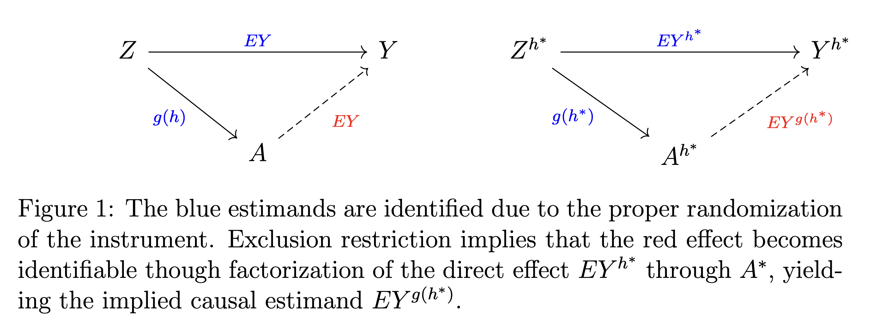

# Causal Inference via Implied Interventions

This repository contains the R code accompanying the paper:

> **Causal Inference via Implied Interventions**  
> *by Carlos García Meixide and Mark J. van der Laan*



## Abstract

In the context of having an instrumental variable, the standard practice in causal inference begins by targeting an effect of interest and proceeds by formulating assumptions enabling its identification. We turn this around by simply not making assumptions anymore and just adhere to the interventions we can identify, rather than starting with a desired causal estimand and imposing untestable conditions.

The randomization of an instrument and its exclusion restriction define a class of auxiliary stochastic interventions on the treatment that are **implied by stochastic interventions on the instrument**. This mapping effectively characterizes the identifiable causal effects of the treatment on the outcome given the observable probability distribution, leading to an explicit and transparent **G-computation formula under hidden confounding**.

Alternatively, searching for an intervention on the instrument whose implied one best approximates a desired target—whose causal effect the user aims to estimate—naturally leads to a **projection on a function space** representing the closest identifiable treatment effect. The generality of this projection allows to select different norms and indexing functional sets that give rise to diverse estimation problems, some of which we address using **Expectation–Maximization** and the **Highly Adaptive Lasso (HAL)**.

Our approach interprets **instrumental-variable–based causal inference** as a projection onto the effect space identifiable from the observed data distribution, rather than relying on potentially risky assumptions that would enable identification under standard theory.

**Keywords:** Instrumental variables · Stochastic interventions · Noncompliance · Functional projections

## Repository Structure

| File | Description |
|------|-------------|
| `data.R` | Helper functions to load data for the application case (Medicaid Oregon lottery) |
| `load_example.R` | Simulates both observational and intervened data according to the paper's introductory NPSEMs example and creates necessary helper functions |
| `intro_example.R` | Reproduces the results in the **introductory example** of the paper |
| `oregon.R` | Replicates the conclusions drawn from the **Medicaid lottery** analysis using implied interventions |
| `plot1.R` | Generates the first plot in the paper, illustrating the new **framework of implied interventions** |
| `sims_eic.R` | Implements **simulation experiments** from Section 7.1 (influence function–based estimators) |
| `sims_em.R` | Implements **EM–based simulations** from Section 7.2 (Expectation–Maximization with HAL) |


## Conceptual Framework

This methodology reverses the traditional order of causal inference with instrumental variables:

1. **Traditional approach**: Start with a desired causal effect → Make assumptions for identification
2. **Our approach**: Start with observable data → Derive which causal effects can be identified

The framework leads to:
- Explicit characterization of identifiable treatment effects
- G-computation formulas under hidden confounding
- Functional projections on identifiable effect spaces

## Key Innovation

> "Rather than postulating what would identify our causal estimand, we let the data tell us which interventions are already implied."

This approach provides a transparent and assumption-light alternative to traditional instrumental variable methods by focusing on what can be identified rather than what we wish to identify.

## Citation

If you use this code or theoretical framework, please cite:

```bibtex
@misc{meixide2025,
      title={Causal inference via implied interventions}, 
      author={Carlos García Meixide and Mark J. van der Laan},
      year={2025},
      eprint={2506.21501},
      archivePrefix={arXiv},
      primaryClass={math.ST},
      url={https://arxiv.org/abs/2506.21501}, 
}
```

## Contact

- **Carlos García Meixide** — [meixide.gal](https://meixide.gal)
- **Mark J. van der Laan** — [vanderlaan-lab.org](https://vanderlaan-lab.org)


---

*This work presents a novel framework for causal inference that prioritizes identification transparency over assumption-making, providing researchers with a principled approach to instrumental variable analysis.*
